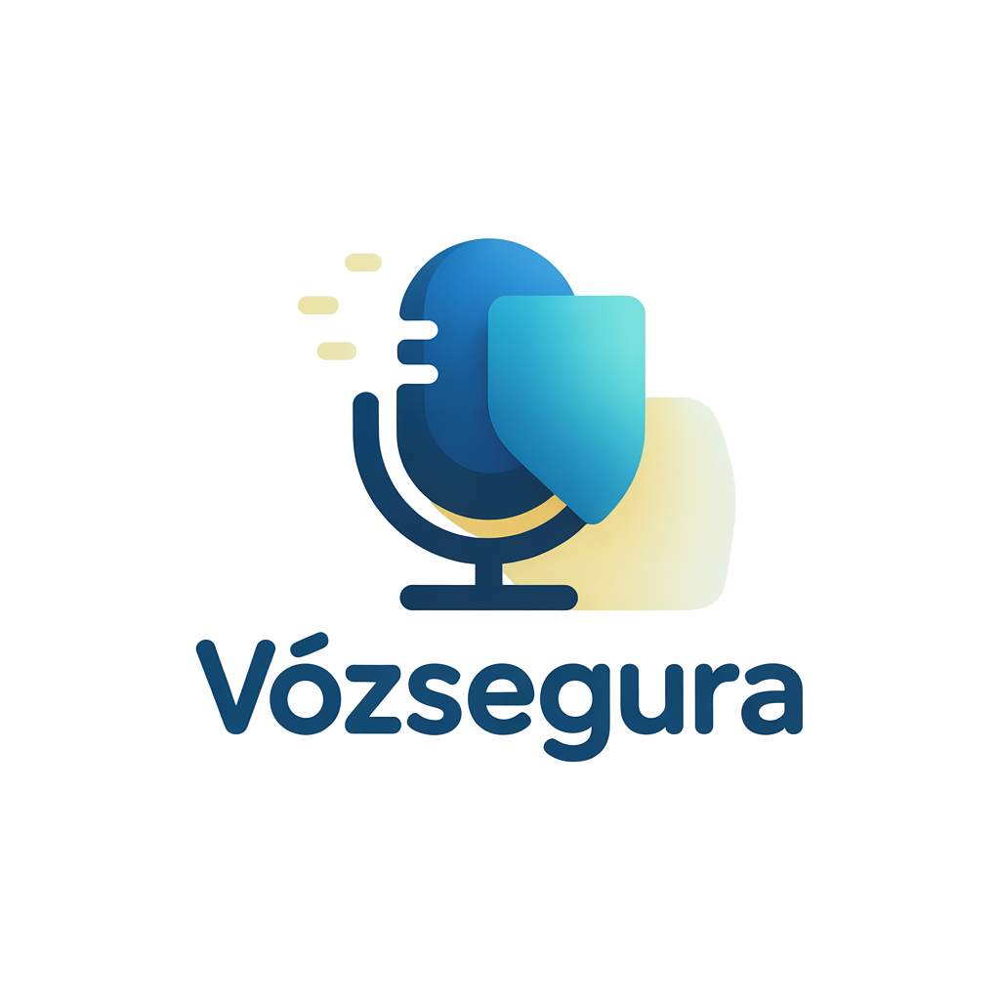

# VozSegura Docs



**VozSegura** e um ecossistema digital focado em combater golpes e desinformacao e promover o letramento digital para pessoas acima de 60 anos. Concebido no Ideathon do Governo de Goias em 2025, ele se baseia no canal mais popular entre o publico idoso: o WhatsApp.

## Conteudo desta documentacao

A pasta [`docs/`](docs/) organiza a documentacao em secoes:

- **Entendimento do problema** – dados e contexto sobre a exclusao digital e a desinformacao entre idosos.
- **Solucao** – descricao completa do ecossistema VozSegura, dividido em modulos (bot de checagem, jornal personalizado, comunidade, gamificacao, etc.).
- **Analise financeira e tecnica** – premissas, custos e viabilidade do projeto.
- **Impacto** – indicadores sociais e economicos esperados.
- **Equipe** – apresentacao do time.
- **Roadmap** – cronograma de execucao com fases e marcos.

## Como navegar no projeto

Voce pode ler os arquivos Markdown diretamente no GitHub ou rodar um site estatico com [Docusaurus](https://docusaurus.io) para uma experiencia de navegacao mais agradavel.

### Executar localmente com Docusaurus

1. Certifique-se de ter [Node.js](https://nodejs.org/) instalado.
2. Dentro do diretorio `website`, instale as dependencias e rode o servidor de desenvolvimento:

```
cd website
npm install
npm run start
```

3. Acesse `http://localhost:3000` no navegador. Para gerar a versao estatica, use `npm run build` dentro da pasta `website`.

## Licenca

Este projeto e distribuido sob a licenca MIT. Consulte o arquivo LICENSE (a ser adicionado).
