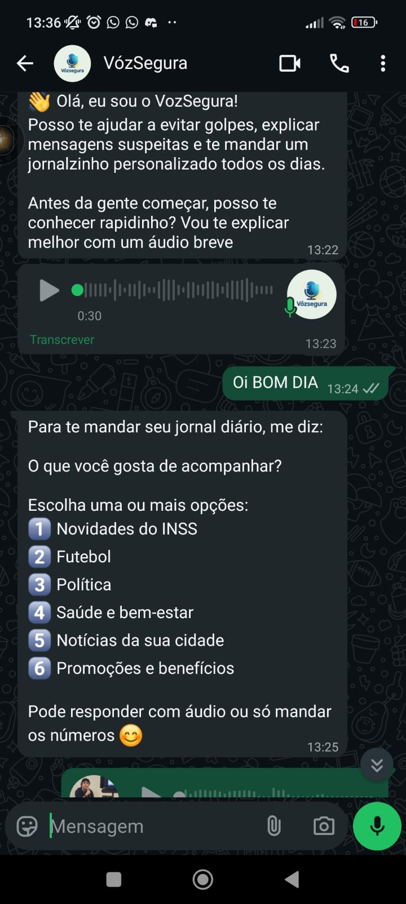
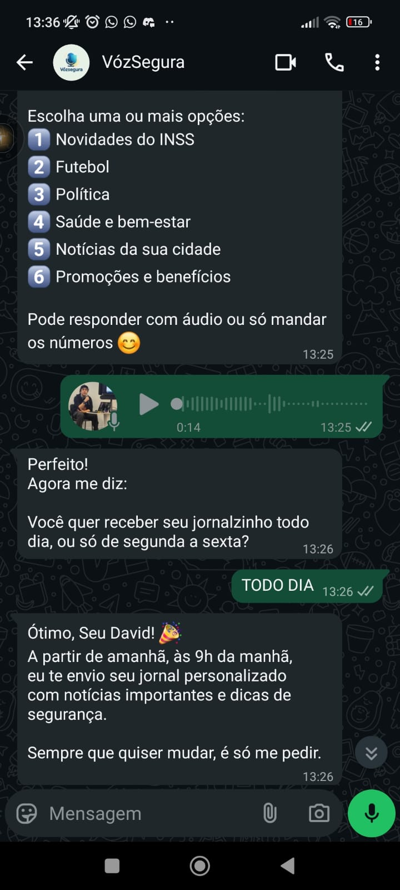
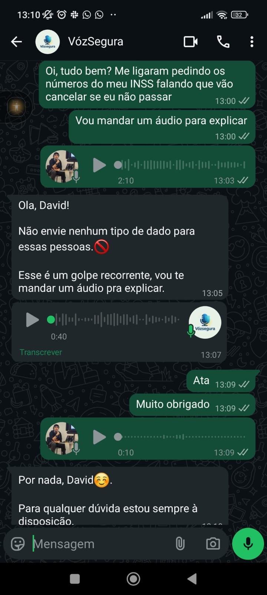
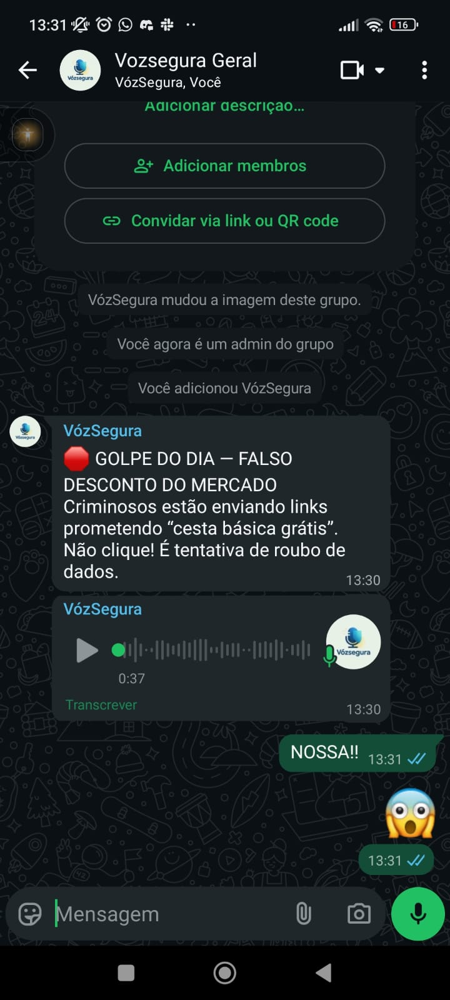
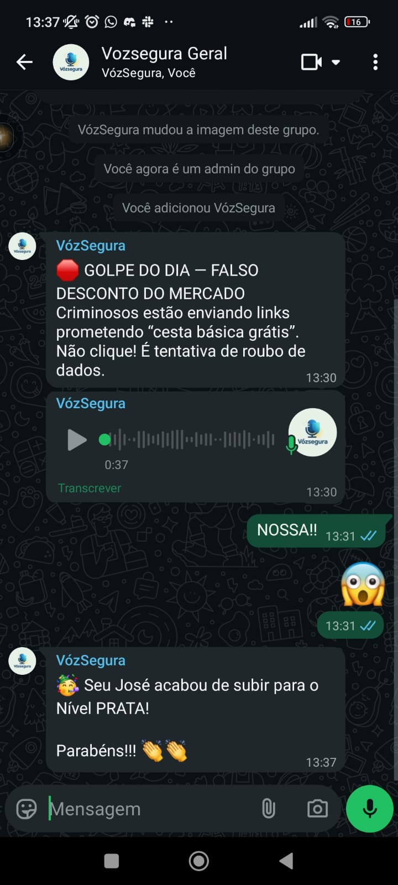
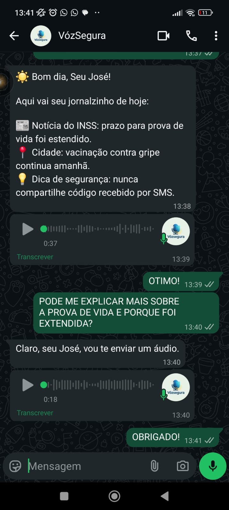

# Fluxo da Solucao VozSegura

A seguir, ilustramos os principais fluxos de uso do VozSegura com imagens reais capturadas no WhatsApp. Cada etapa foi pensada para ser simples, clara e acolhedora para pessoas acima de 60 anos.

## 1. Contato inicial e personalizacao da newsletter

Quando o usuario envia uma mensagem para o VozSegura pela primeira vez, nosso assistente de voz inicia uma conversa para entender seus interesses e horarios preferidos. Em seguida, a IA confirma e informa quando o jornal personalizado passara a chegar.

## 2. Checagem de mensagem suspeita

Sempre que o idoso receber um audio, texto ou imagem duvidosa, pode encaminhar direto para o contato do VozSegura. A IA analisa o conteudo, checa nas bases de fact-checking e responde em audio e texto com veredito, explicacao curta e dica de protecao.

## 3. Golpe do dia no grupo geral

No Clube da Melhor Idade, o VozSegura publica diariamente um aviso de golpe recorrente, explicando como ele funciona e orientando todos a nao cair. Essa mensagem vem acompanhada de audio explicativo.

## 4. Desafio diario e gamificacao

Para transformar o letramento digital em um habito divertido, o VozSegura envia um desafio diario no privado. O usuario responde se cada mensagem e verdadeira ou golpe e, ao acertar, ganha pontos e sobe de nivel. O avanco de nivel e comemorado publicamente no grupo, incentivando os demais.

## 5. Noticia personalizada no privado

Todos os dias, de acordo com a configuracao feita no onboarding, o VozSegura envia um mini jornal em audio e texto. Nele aparecem as noticias de interesse do usuario, as atualizacoes importantes da cidade, do INSS ou do time favorito, e uma dica de seguranca digital.

---

Esses fluxos demonstram como o VozSegura combina checagem de fatos, educacao e interacao social para criar um ambiente digital seguro, inclusivo e participativo para o publico 60+.
